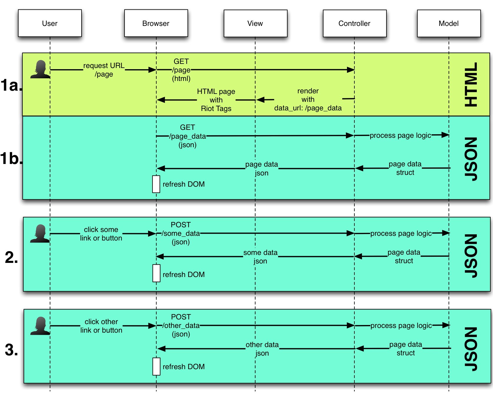
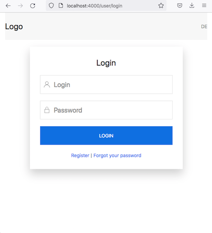
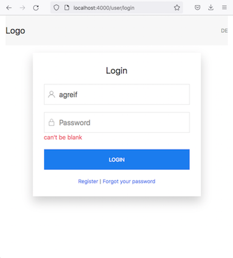
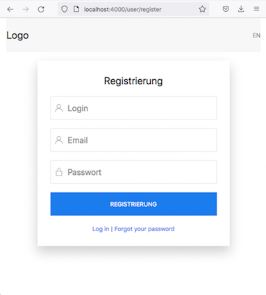
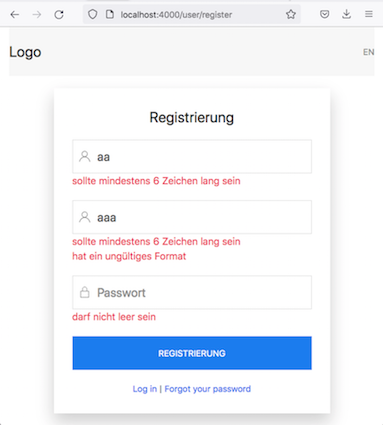
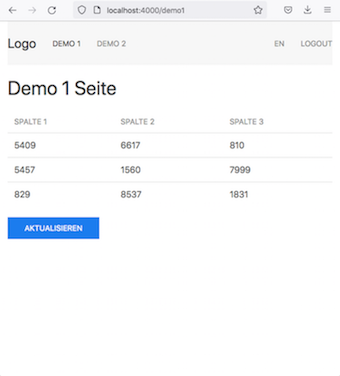
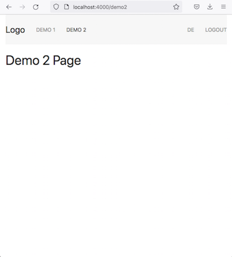

# phx-riotjs
Template (proof-of-concept) project that uses
- Elixir/Phoenix webserver
- RiotJS component-based UI library
- UIKit
- Pure frontend HTML rendering with DOM-manipulation
- JSON data transfer
- Browser history handling
- Form submission happens with JSON data transfer and CSRF tags
- Form validation with Ecto Changesets (only the registration form)
- User registration stored to PostgreSQL DB with validations
- i18n with gettext domains

# Data flow



In the image three user requests are shown
- the first is an initial URL page request (HTML+JSON)
- the second and third are in-application actions like clicking links or buttons (JSON)

**1a.** if a HTTP page URL is requested the page skeleton and all RiotJS tags (javascript modules) are transfered to the browser.

**1b.** Right after loading the riot tags the page-data is fetched as JSON that manipulates the DOM-tree with the help of the RiotJS framework.

**2.** All subsequent user actions in the browser transfer JSON to the server and receive JSON page-data as a response.
- The controller delegates to the model that executes the business logic that is then directly sent ot the browser without invoking the view layer.
- On the client RiotJS uses the JSON responses to manipulate the DOM-tree.
- The page-data also contains information for setting the browser state (history and buttons).
- Form input fields are also sent as JSON to the backend

**3.** The same as 2. :) It is only a demonstration that except the very first call to the server all communication is JSON that leads to business logic execution on the server and DOM-manipulation in the browser


# Pages









# Run Phoenix Server and RiotJS auto-compile
```
$ cd riotjs
$ sh run_dev.sh
```

The 'run_dev.sh' script starts the development server mode with
- RiotJS tag compilation in watch mode
- gettext extraction
- phoenix server start

# Prerequisites
Install RiotJS
```
cd riotjs
npm install @riotjs/cli
```

# Sample RiotJS Tag definition
riotjs/priv/static/riot/todo.riot
```
<todo>
  <h1>{ stateMessage }</h1>
  <p>{ propsMessage }</p>

  <script>
    export default {
      state: {
        message: 'text defined in statr',
      },
      get stateMessage() {
        return this.state.message;
      },
      get propsMessage() {
        return this.props.message;
      },
    }
  </script>
</todo>
```

# Tag Usage
riotjs/lib/riotjs_web/templates/page/index.html.heex
```
  <todo message="kkk"></todo>
```

# General configs
riotjs/lib/riotjs_web/endpoint.ex
```
-    only: ~w(assets fonts images favicon.ico robots.txt)
+    only: ~w(assets fonts images favicon.ico robots.txt riot)
```

# Config for RiotJS in-browser compile

Add RiotJS .js file:

riotjs/assets/vendor/riot_compiler.js

riotjs/assets/js/app.js
```
import * as riot from "../vendor/riot_compiler"
// expose riot
window.riot = riot
```

riotjs/lib/riotjs_web/templates/layout/root.html.heex
```
  <head>
    ...
-   <script defer phx-track-static type="text/javascript" src={Routes.static_path(@conn, "/assets/app.js")}></script>
+   <script       phx-track-static type="text/javascript" src={Routes.static_path(@conn, "/assets/app.js")}></script>

    <script data-src="/riot/todo.riot" type="riot"></script>
    <script>
      (async function main() {
            await riot.compile()
            riot.mount('todo')
      }())
    </script>
```

# Config for RiotJS external CLI compile

Add RiotJS .js file:

riotjs/assets/vendor/riot.js

riotjs/assets/js/app.js
```
import * as riot from "../vendor/riot"
// expose riot
window.riot = riot
```

riotjs/lib/riotjs_web/templates/layout/root.html.heex
```
  <head>
    ...
    <script data-src="/riot/todo.js" type="riot"></script>
    <script type="module">
      import TodoTag from './riot/todo.js'
      riot.register('todo', TodoTag)
      riot.mount('todo')
    </script>
```
